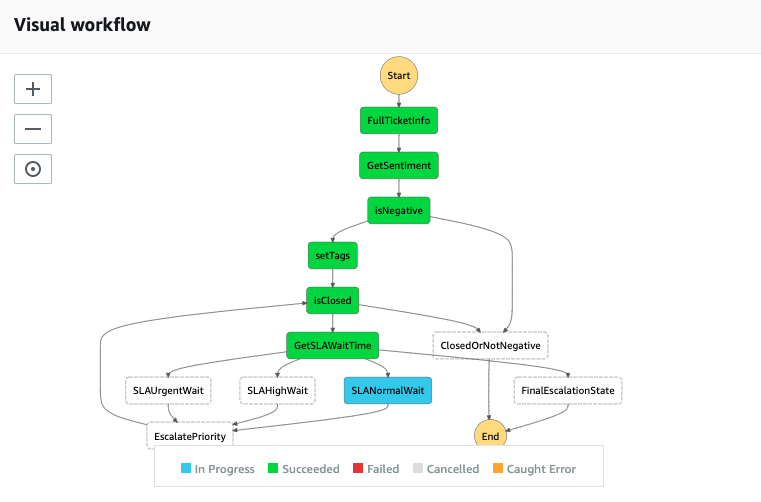
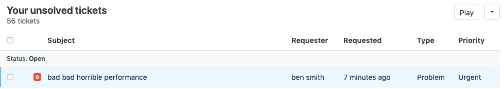

# Automated ticket analysis and escalation


- [Automated ticket analysis and escalation](#automated-ticket-analysis-and-escalation)
- [Intro](#intro)
  - [Requirements](#requirements)
  - [Installation Instructions](#installation-instructions)
  - [Parameter Details](#parameter-details)
    - [Escalation Wait time parameters](#escalation-wait-time-parameters)
    - [Zendesk Integration parameters](#zendesk-integration-parameters)
  - [How it works](#how-it-works)
  - [Set up](#set-up)
  - [Running the application](#running-the-application)
  - [Integrating Zendesk with Event Bridge](#integrating-zendesk-with-event-bridge)

# Intro
This application "listens" for a ticket creation event from Zendesk, analyses the ticket for negative sentiment, tags the ticket accordingly and invokes an automated workflow (Step function) that escalates the ticket's priority according to your SLA wait times.

Important: this application uses various AWS services and there are costs associated with these services after the Free Tier usage - please see the [AWS  pricing page](https://aws.amazon.com/pricing/) for details.  This application also requires a Zendesk account.

```bash
.
├── README.MD                       <-- This instructions file
├── screenshots                     <-- Screenshots
└── lambdas                         <-- dir for the lambda functions
│   └── getFullTicket               <-- dir for the GettFullTicket Lambda Function
│   │   └── getFullTicket.js        <-- lambda function, uses Zendesk API to return Full ticket data
│   │   └── package.json            <-- NodeJS dependencies and scripts for this function
│   └── getSentiment                <-- dir for the getSentiment Lambda Function
│   │   └── getSentiment.js         <-- lambda function, invokes Comprehend:DetectSentiment
│   │   └── package.json            <-- NodeJS dependencies and scripts for this function
│   └── setPriority                 <-- dir for the setPriority Lambda Function
│   │   └── setPriority.js          <-- lambda function, uses Zendesk api to update ticket priority
│   │   └── package.json            <-- NodeJS dependencies and scripts for this function
│   └── setTags                     <-- dir for the setTags Lambda Function
│   │   └── setTags.js              <-- lambda function, uses Zendesk api to update ticket tags
│   │   └── package.json            <-- NodeJS dependencies and scripts for this function
├── template.yml                    <-- SAM template
├── buildspec.yml                   <-- CodeBuild template
├── LICENSE                         <-- MIT license file
```

## Requirements

- AWS CLI already configured with Administrator permission
- Zendesk account with Event bridge integration enabled.

## Installation Instructions

1. [Create an AWS account](https://portal.aws.amazon.com/gp/aws/developer/registration/index.html) if you do not already have one and login.
2. [Create a Zendesk account](https://www.zendesk.com/register) and activate the Event Bridge integration via [this registration form](https://docs.google.com/forms/d/e/1FAIpQLSd_UXeXV5L7vGIyRY6gSL64pu2SS-CmquxNusex60QGR1d_TQ/viewform)
3. Go to the app's page on the [Serverless Application Repository](https://serverlessrepo.aws.amazon.com/applications/arn:aws:serverlessrepo:us-east-1:677501797858:applications~Automated-Support-Ticket-Moderator) and click "Deploy"
4. Provide the required app parameters (see parameter details below) and click "Deploy"

## Parameter Details
### Escalation Wait time parameters

* `SLANormalWait`: provide a level 1 wait time for tickets that has priority status "normal"
* `SLAHighWait`: provide a level 2 wait time for tickets that has priority status "High"
* `SLAUrgentWait`: provide a level 3 wait time for tickets that has priority status "Urgent"

### Zendesk Integration parameters
*   `ZenDeskUsernameKey`: Your Zendesk agent username that will connect to the Zedesk API
*   `ZenDeskTokenKey`: Your Zendesk API Token
*   `ZenDeskDomainKey`: Your Unique Zendesk Domain name (excluding https:// and .com)
for instructions on where to find these go to [Integrating Zendesk with Event Bridge](https://github.com/bls20AWS/severless-ticket-sentiment-analysys-and-automated-escalation#integrating-zeddesk-with-event-bridge)

## How it works



- This application deploys 4 lambda functions that are orchestrated via a single step function.
- The step function's execution is triggered when a ticket is created via an event bridge integration with Zendesk.
- First the ticket's subject is a analysed for negative sentiment using AWS Comprehend.  
- If it is found to be negative, then an API call is made to Zendesk to retrieve the ticket's full metadata.
- A tag `negative` is applied to the ticket.
- The ticket now enters the escalation loop, if the ticket is not closed it's `priority` is escalated after each wait time is reached.
- The step function exits when the ticket is closed, or the final escalation `urgent` wait time has passed.

## Set up

- Deploy this serverless application with your Zendesk credentials and SLA wait times.
- Create a Zendesk Event Bus with Event Bridge (instructions below).

## Running the application

Once set up is complete, create a ticket in Zendesk and see it's tag and priority update over the course of the step function's life cycle.

## Integrating Zendesk with Event Bridge

- Follow these instructions to create a Zendesk Event bus.
- [connect Zendesk to aws EventBridge](https://support.zendesk.com/hc/en-us/community/posts/360033236454-Sending-Zendesk-events-to-Amazon-EventBridge-)
- Create a new Rule for the event bus.
    - Select Partner integration > Zendesk
    - Edit the event pattern with the JSON script below:
         ```javascript
        {
            "account": [
                "{YourAWSAccountNumber}"
            ],
            "detail-type": [
                "Support Ticket: Ticket Created"
            ]
        }
        ```
  - Select the Zendesk event bus.
  - Select Step Function State Machines as the target.
  - Select the new Sate machine.
  - Select `Create A new role for this resource`.
  - Make sure the rule is enabled.

Copyright 2019 Amazon.com, Inc. or its affiliates. All Rights Reserved.
SPDX-License-Identifier: MIT-0
